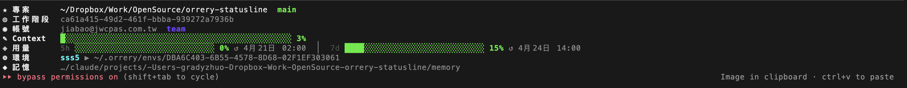

# orrery-statusline

A compact, multi-line statusline for [Claude Code](https://docs.claude.com/claude-code),
designed to work alongside [orrery](https://github.com/) environments.

It renders project, session, account, context usage, rate-limit usage, active
orrery environment, and the project's memory directory — all in a single glance.



## What each row means

| Icon | Label (zh-Hant / en) | Description |
| ---- | -------------------- | ----------- |
| ★    | `專案` / `Project`    | Current working directory (home-shortened) plus the current git branch. A `(N)` badge counts dirty files. |
| ◎    | `工作階段` / `Session` | Claude Code session id (from the JSON passed in on stdin). |
| ◉    | `帳號` / `Account`    | Logged-in email, subscription plan (`max` / `pro` / `team` / `free`), and the configured model. The whole row is skipped when the email cannot be read. |
| ✎    | `Context`             | Context-window usage of the current conversation. The bar's right edge lines up with the `│` divider of the usage row below. |
| ◈    | `用量` / `Usage`      | Claude rate-limit usage: **5h** window on the left, **7d** window on the right, each with a percentage and reset time. Cached for 8 hours so the bars stay visible between turns that don't carry live rate-limit data. |
| ⊕    | `環境` / `Env`        | The active orrery environment (`$ORRERY_ACTIVE_ENV`) and the path to its env directory under `~/.orrery/envs/...`. |
| ◆    | `記憶` / `Memory`     | Path to the Claude memory directory for this project within the active environment. |

Rows that have no data (no session id, no active env, no memory directory, no
readable account email) are omitted rather than shown empty.

## Install

1. Drop `statusline.js` somewhere stable — e.g. `~/.claude/statusline.js`.
2. Point Claude Code at it in your `~/.claude/settings.json`:

   ```json
   {
     "statusLine": {
       "type": "command",
       "command": "node ~/.claude/statusline.js"
     }
   }
   ```

3. Start a new Claude Code session. The statusline reads the JSON payload
   Claude Code pipes to it on stdin, so no extra flags are needed.

Requires Node.js (any recent LTS) and a terminal that renders ANSI colors and
CJK-wide characters correctly.

## Language

The label language follows `$LANG` / `$LC_ALL` / `$LC_MESSAGES`:

- `zh_TW` / `zh_HK` / `zh-Hant` → Traditional Chinese
- `zh_CN` / `zh_SG` / `zh-Hans` → Simplified Chinese
- anything else → English

## Data sources

- **Session, context, rate limits, cwd, model** — from the JSON Claude Code
  writes to stdin each turn.
- **Account email** — `$CLAUDE_CONFIG_DIR/.claude.json` (falls back to
  `~/.claude.json`), field `oauthAccount.emailAddress`.
- **Account plan** — macOS Keychain entry
  `Claude Code-credentials[-<hash>]`, field `claudeAiOauth.subscriptionType`.
  Non-macOS hosts simply skip this lookup.
- **Model** — `$CLAUDE_CONFIG_DIR/settings.json` → `~/.claude/settings.json`,
  field `model`.
- **Orrery env** — `$ORRERY_ACTIVE_ENV` plus a scan of
  `~/.orrery/envs/*/env.json`.
- **Git branch & dirty count** — `git -C <cwd> rev-parse` and
  `git -C <cwd> status --porcelain`.

## Cache

A small JSON cache at `~/.orrery/statusline-cache.json` keeps rate-limit data
for 8 hours and account data for 24 hours so the statusline stays populated
across turns. Delete this file to force a refresh.
