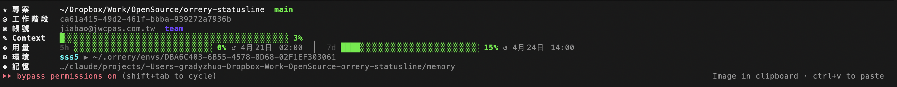

# orrery-statusline

A compact, multi-line statusline for [Claude Code](https://docs.claude.com/claude-code),
designed to work alongside [orrery](https://github.com/) environments.

It renders project, session, account, context usage, rate-limit usage, active
orrery environment, and the project's memory directory — all in a single glance.



## What each row means

| Icon | Label (zh-Hant / en) | Description |
| ---- | -------------------- | ----------- |
| ★    | `專案` / `Project`    | Current working directory (home-shortened) plus the current git branch. A `(N)` badge counts dirty files. |
| ◎    | `工作階段` / `Session` | Claude Code session id (from the JSON passed in on stdin). |
| ◉    | `帳號` / `Account`    | Orrery account name (the identity `orrery use <name>` selects), logged-in email, subscription plan (`max` / `pro` / `team` / `free`), and the configured model. The row is skipped only when neither the account name nor the email can be read. |
| ✎    | `Context`             | Context-window usage of the current conversation. The bar's right edge lines up with the `│` divider of the usage row below. |
| ◈    | `用量` / `Usage`      | Claude rate-limit usage, one row per window: **5h**, **7d**, then one row per model-scoped weekly window the server reports for your plan (e.g. **Fable**), each with a percentage and reset time. The 5h / 7d rows are cached for 8 hours so the bars stay visible between turns that don't carry live rate-limit data. Model-scoped rows are only shown when `/usage` would list them; accounts without one get no extra row. |
| ⊕    | `沙盒` / `Sandbox`    | The active orrery sandbox (`$ORRERY_ACTIVE_ENV`) and the path to its sandbox directory under `~/.orrery/envs/...`. Shows `origin` plus `~/.orrery/origin` when no sandbox is active. |
| ◆    | `記憶` / `Memory`     | Path to the Claude memory directory for this project within the active environment. |

Rows that have no data (no session id, no active env, no memory directory, no
readable account email) are omitted rather than shown empty.

## Install

1. Drop `statusline.js` somewhere stable — e.g. `~/.claude/statusline.js`.
2. Point Claude Code at it in your `~/.claude/settings.json`:

   ```json
   {
     "statusLine": {
       "type": "command",
       "command": "node ~/.claude/statusline.js"
     }
   }
   ```

3. Start a new Claude Code session. The statusline reads the JSON payload
   Claude Code pipes to it on stdin, so no extra flags are needed.

### Via `orrery thirdparty install statusline`

Orrery's own installer does not point `settings.json` at this file directly.
It installs two files:

- `statusline.js` → the pinned workspace's shared claude dir (one copy, reused
  by every account pinned to that workspace).
- `statusline-dispatch.js` → the account dir, as `statusline.js`. This is what
  `settings.json` actually points at, and it never has to change again: on
  every render it reads the account's `metadata.json` for its *current*
  workspace pin, resolves that workspace's dir via `orrery-bin
  _workspace-dir`, and hands off to the `statusline.js` living there. So
  `orrery pin <account> --workspace <name>` takes effect immediately, with no
  settings.json edit or reinstall required.

Requires Node.js (any recent LTS) and a terminal that renders ANSI colors and
CJK-wide characters correctly.

## Language

The label language follows `$LANG` / `$LC_ALL` / `$LC_MESSAGES`:

- `zh_TW` / `zh_HK` / `zh-Hant` → Traditional Chinese
- `zh_CN` / `zh_SG` / `zh-Hans` → Simplified Chinese
- anything else → English

## Data sources

- **Session, context, 5h / 7d rate limits, cwd, model** — from the JSON Claude
  Code writes to stdin each turn.
- **Model-scoped weekly usage (e.g. Fable)** — Claude Code does not pass these
  windows to the statusline, so they are read from the same claude.ai usage
  endpoint the `/usage` command uses (`GET https://api.anthropic.com/api/oauth/usage`),
  taking the `limits[]` rows of kind `weekly_scoped`. The request is
  authenticated with the OAuth access token Claude Code is already logged in
  with (Keychain entry `Claude Code-credentials[-<hash>]`, field
  `claudeAiOauth.accessToken`, or `$CLAUDE_CONFIG_DIR/.credentials.json` on
  non-macOS hosts). No API key, no extra spend: this is the subscription's own
  usage endpoint, and querying it does not count against any limit. The token
  is never written to the cache or printed.
- **Account email** — `$CLAUDE_CONFIG_DIR/.claude.json` (falls back to
  `~/.claude.json`), field `oauthAccount.emailAddress`.
- **Account plan** — macOS Keychain entry
  `Claude Code-credentials[-<hash>]`, field `claudeAiOauth.subscriptionType`.
  Non-macOS hosts simply skip this lookup.
- **Model** — `$CLAUDE_CONFIG_DIR/settings.json` → `~/.claude/settings.json`,
  field `model`.
- **Active sandbox** — `$ORRERY_ACTIVE_ENV` plus a scan of
  `~/.orrery/envs/*/env.json` (the on-disk directory name is still `envs/`
  for compatibility with older installs).
- **Git branch & dirty count** — `git -C <cwd> rev-parse` and
  `git -C <cwd> status --porcelain`.

## Cache

A small JSON cache lives inside the per-account config dir
(`$CLAUDE_CONFIG_DIR/statusline-cache.json`, falling back to
`~/.claude/statusline-cache.json` at origin), so each account's cache is
naturally isolated. It keeps rate-limit data for 8 hours and account data for
24 hours so the statusline stays populated across turns. Delete this file to
force a refresh.

Model-scoped usage rows are the one thing that needs a network call, and the
render path never waits on it. They are cached for 5 minutes; when the cache is
older than that, the statusline prints the last known rows and spawns a
detached `node statusline.js --refresh-scoped-limits` child that fetches the
endpoint and writes the cache for the next render. A 60-second lock prevents
overlapping refreshes, and failed fetches (offline, expired token) keep the last
rows for up to 24 hours instead of dropping the row. The cache records which
account (`oauthAccount.accountUuid`) the rows belong to, so an `orrery use`
switch hides them until the new account's rows arrive.

## Tests

```sh
node --test
```

The suite covers the usage-endpoint parsing (with a recorded response in
`test/fixtures/`), the cache / background-refresh rules, and the rendered rows.
